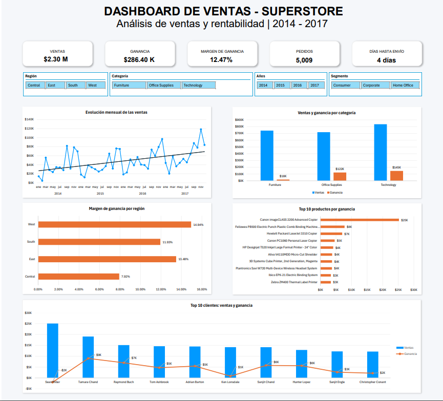
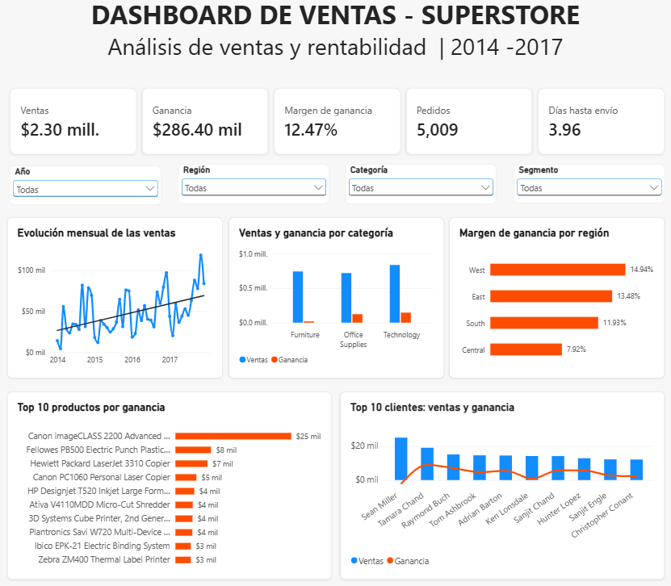

# Superstore Sales & Profitability Analysis

## Project Overview

This project analyzes the sales and profitability performance of the Superstore dataset using Excel and Power BI. The analysis focuses on identifying sales trends, evaluating profitability, and comparing the performance of products, customers, categories, and regions.

The goal is to transform transactional sales data into meaningful insights that can support business decision-making.

## Dataset

The dataset used in this project is the **Superstore Dataset**, publicly available on Kaggle. It contains transactional sales data including orders, customers, products, categories, regions, sales, discounts, and profit.

**Source:** [Superstore Dataset - Kaggle](https://www.kaggle.com/datasets/vivek468/superstore-dataset-final)

The dataset contains **9,994 records and 21 columns** covering sales transactions from **2014 to 2017**.

## Business Objective

The objective of this project is to analyze Superstore's sales and profitability performance to identify the products, customers, regions, and time periods with the best and worst performance, as well as opportunities for improvement that can support business decision-making.

## Tools & Technologies

- **Microsoft Excel** — Data analysis, pivot tables, KPIs, and dashboard development.
- **Power Query** — Data cleaning, transformation, and validation.
- **Power BI** — Data modeling, interactive visualizations, and dashboard development.
- **DAX** — Measures and calculations for business KPIs.

## Data Preparation

The original dataset contains **9,994 records and 21 columns**. Before performing the analysis, the data was cleaned and prepared using Power Query.

The main preparation steps included:

- Correcting and validating data types for dates and numerical fields.
- Importing date fields using the appropriate locale to ensure correct date interpretation.
- Checking for missing values, errors, and duplicate records.
- Validating order and customer identifiers.
- Converting postal codes to text to preserve their categorical nature.
- Creating a **Days to Ship** field to calculate the number of days between the order date and ship date.
- Verifying data quality before building the analytical model and dashboards.

## KPIs & Analysis

The analysis was developed using business KPIs and interactive visualizations in Excel and Power BI. In Power BI, DAX measures and a dedicated calendar table were used to support dynamic analysis and filtering.

### Main KPIs

- **Total Sales:** $2.30M
- **Total Profit:** $286.40K
- **Profit Margin:** 12.47%
- **Orders:** 5,009
- **Customers:** 793
- **Units Sold:** 37,873
- **Average Days to Ship:** 3.96 days

### Analysis Areas

The project explores performance across:

- Sales trends over time.
- Categories and subcategories.
- Products and customers.
- Customer segments.
- Regions and states.
- Discounts and profitability.
- Shipping modes and order-to-ship times.

## Key Insights

- **Sales trend:** Sales show an overall upward trend from 2014 to 2017, with 2017 recording the highest annual sales. Higher sales levels are also observed during the final months of the year.

- **Category profitability:** Technology generated the highest sales and profit, while Furniture showed significantly lower profitability despite its high sales volume. Within Furniture, Tables and Bookcases generated losses.

- **Discounts and profitability:** Within Furniture, discounts and profit showed a moderate negative correlation (r ≈ -0.48), indicating that higher discounts tend to be associated with lower profit.

- **Regional performance:** West achieved the highest sales, profit, and profit margin (14.94%), while Central recorded the lowest margin (7.92%). Texas and Illinois were major contributors to losses within the Central region.

- **Products and customers:** High sales did not always translate into high profitability. Several top-selling products and customers generated low or negative profit, highlighting the importance of evaluating sales together with profit and margin.

- **Shipping:** Standard Class was the most frequently used shipping mode and had an average order-to-ship time of approximately 5 days.

## Dashboards

Interactive dashboards were developed in both Excel and Power BI to visualize the main KPIs, trends, and profitability patterns identified during the analysis.

### Excel Dashboard

The Excel dashboard was developed using pivot tables, charts, KPIs, and interactive slicers.

### Power BI Dashboard

The Power BI dashboard uses DAX measures, an interactive data model, and dynamic filters to explore sales and profitability across different dimensions.

## Recommendations & Conclusion

Based on the analysis, the following opportunities were identified:

- Review discount strategies for products and subcategories with high sales but low or negative profitability.
- Closely monitor loss-generating products and evaluate their contribution to overall business performance.
- Investigate the factors affecting profitability in the Central region, particularly in Texas and Illinois.
- Evaluate performance using sales, profit, and profit margin together rather than relying only on sales volume.
- Consider seasonal sales patterns when planning inventory and commercial strategies.

### Conclusion

The analysis shows that higher sales do not necessarily translate into higher profitability. Evaluating sales together with profit, margin, discounts, and regional performance provides a more complete view of business performance and helps identify opportunities for more informed decision-making.
